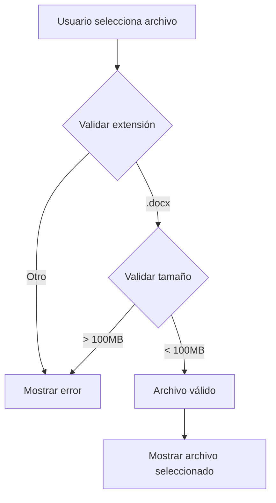
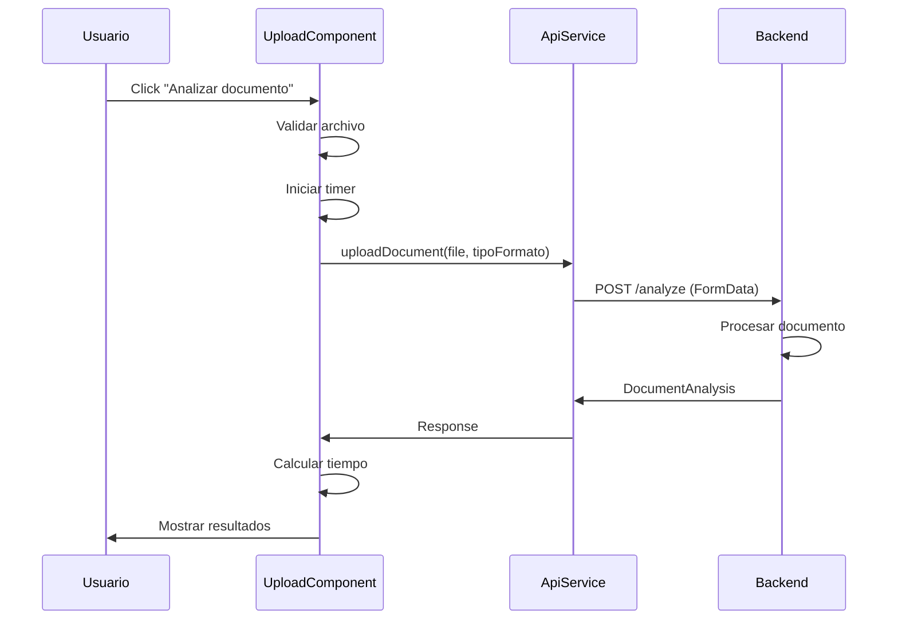

# Documentación Técnica - IA Word Agent Frontend

## Índice
1. [Descripción General](#descripción-general)
2. [Arquitectura](#arquitectura)
3. [Tecnologías y Dependencias](#tecnologías-y-dependencias)
4. [Estructura del Proyecto](#estructura-del-proyecto)
5. [Componentes](#componentes)
6. [Servicios](#servicios)
7. [Modelos de Datos](#modelos-de-datos)
8. [Configuración](#configuración)
9. [Instalación y Ejecución](#instalación-y-ejecución)
10. [Flujo de Trabajo](#flujo-de-trabajo)
11. [Validaciones](#validaciones)
12. [Estilos y UI](#estilos-y-ui)

---

## Descripción General

**IA Word Agent Frontend** es una aplicación web desarrollada en Angular 21 que permite a los usuarios cargar documentos Word (.docx) para su análisis automático mediante inteligencia artificial. La aplicación evalúa la calidad del documento según estándares predefinidos y proporciona recomendaciones de mejora.

### Características Principales
- Carga de archivos mediante drag & drop o selección manual
- Validación de archivos (formato y tamaño)
- Selección de tipo de formato de documento
- Análisis en tiempo real con indicador de progreso
- Visualización de resultados con métricas de calidad
- Recomendaciones específicas por página
- Identificación de información faltante

---

## Arquitectura

### Patrón de Arquitectura
La aplicación sigue una arquitectura basada en componentes standalone de Angular, con las siguientes características:

- **Componentes Standalone**: No requiere módulos NgModule
- **Inyección de Dependencias**: Uso de servicios con `providedIn: 'root'`
- **Comunicación HTTP**: Cliente HTTP para comunicación con el backend
- **Enrutamiento**: Sistema de rutas de Angular Router
- **Reactive Programming**: RxJS para manejo de operaciones asíncronas

### Diagrama de Arquitectura
```
┌─────────────────────────────────────────┐
│         AppComponent (Root)             │
│  - Header con navegación                │
│  - RouterOutlet                         │
└─────────────────┬───────────────────────┘
                  │
                  ▼
┌─────────────────────────────────────────┐
│       UploadComponent                   │
│  - Carga de archivos                    │
│  - Validación                           │
│  - Visualización de resultados          │
└─────────────────┬───────────────────────┘
                  │
                  ▼
┌─────────────────────────────────────────┐
│         ApiService                      │
│  - Comunicación con backend             │
│  - Endpoint: POST /analyze              │
└─────────────────────────────────────────┘
```

---

## Tecnologías y Dependencias

### Framework Principal
- **Angular**: 21.2.2
- **TypeScript**: 5.9.2
- **RxJS**: 7.8.0

### UI Framework
- **CoreUI Angular**: 5.6.19
- **CoreUI CSS**: 5.6.0
- **CoreUI Icons**: 3.0.1
- **Bootstrap**: 5.3.8

### Herramientas de Desarrollo
- **Angular CLI**: 21.2.1
- **Vitest**: 4.0.8 (Testing)
- **Prettier**: 3.8.1 (Formateo de código)

### Dependencias Clave
```json
{
  "@angular/animations": "^21.2.2",
  "@angular/common": "^21.2.2",
  "@angular/forms": "^21.2.2",
  "@angular/router": "^21.2.2",
  "@coreui/angular": "^5.6.19",
  "bootstrap": "^5.3.8"
}
```

---

## Estructura del Proyecto

```
ia-word-agent-front/
├── src/
│   ├── app/
│   │   ├── icons/
│   │   │   └── icon-subset.ts          # Iconos utilizados
│   │   ├── services/
│   │   │   └── api.ts                  # Servicio de comunicación HTTP
│   │   ├── upload/
│   │   │   ├── upload.ts               # Componente principal
│   │   │   ├── upload.html             # Template
│   │   │   └── upload.css              # Estilos
│   │   ├── app.ts                      # Componente raíz
│   │   ├── app.html                    # Template raíz
│   │   ├── app.css                     # Estilos globales
│   │   ├── app.config.ts               # Configuración de la app
│   │   └── app.routes.ts               # Definición de rutas
│   ├── main.ts                         # Punto de entrada
│   └── styles.css                      # Estilos globales
├── public/
│   └── favicon.ico
├── angular.json                        # Configuración de Angular
├── package.json                        # Dependencias
├── tsconfig.json                       # Configuración TypeScript
└── README.md
```

---

## Componentes

### 1. AppComponent
**Ubicación**: `src/app/app.ts`

**Responsabilidad**: Componente raíz de la aplicación que contiene el layout principal.

**Características**:
- Header con navegación
- RouterOutlet para renderizar componentes según la ruta
- Configuración de iconos mediante IconSetService

**Código clave**:
```typescript
@Component({
  selector: 'app-root',
  standalone: true,
  imports: [
    CommonModule,
    RouterOutlet,
    RouterLink,
    RouterLinkActive,
    ContainerComponent,
    HeaderComponent,
    // ...
  ],
  templateUrl: './app.html',
  styleUrls: ['./app.css']
})
export class AppComponent {
  title: string = 'IA Word Agent';
  
  constructor(private iconSetService: IconSetService) {
    this.iconSetService.icons = { ...iconSubset };
  }
}
```

### 2. UploadComponent
**Ubicación**: `src/app/upload/upload.ts`

**Responsabilidad**: Componente principal para la carga y análisis de documentos.

**Propiedades**:
- `file`: Archivo seleccionado
- `analysis`: Resultado del análisis
- `loading`: Estado de carga
- `isDragging`: Estado de drag & drop
- `error`: Mensajes de error
- `tipoFormato`: Tipo de formato seleccionado
- `MAX_FILE_SIZE`: 100 MB
- `ALLOWED_EXTENSIONS`: ['.docx']

**Métodos principales**:


| Método | Descripción |
|--------|-------------|
| `onFileSelected(event)` | Maneja la selección de archivo mediante input |
| `onDragOver(event)` | Maneja el evento de arrastrar sobre la zona |
| `onDragLeave(event)` | Maneja cuando el archivo sale de la zona |
| `onDrop(event)` | Maneja el evento de soltar archivo |
| `validateAndSetFile(file)` | Valida extensión y tamaño del archivo |
| `clearFile()` | Limpia el archivo y resultados |
| `uploadFile()` | Envía el archivo al backend para análisis |
| `formatFileSize(bytes)` | Formatea el tamaño del archivo |
| `formatTime(seconds)` | Formatea el tiempo de procesamiento |

**Tipos de Formato Soportados**:
```typescript
readonly TIPOS_FORMATO = [
  { value: 'corona', label: 'GST-FT-005 - Documentación Tecnica Proyectos - Corona' },
  { value: 'linea_directa', label: 'GST-FT-005 - Documentación Tecnica Proyectos - Linea Directa' },
  { value: 'new_inntech', label: 'GST-FT-005 - Documentación Tecnica Proyectos - New Inntech' },
  { value: 'novaventa', label: 'GST-FT-005 - Documentación Tecnica Proyectos - Novaventa - Netw' },
  { value: 'nutresa_netw', label: 'GST-FT-005 - Documentación Tecnica Proyectos - Nutresa - Netw Pideky' },
  { value: 'nutresa_proyectos', label: 'GST-FT-005 - Documentación Tecnica Proyectos - Nutresa Proyectos' },
  { value: 'web_back', label: 'GST-FT-007 - Documentación Tecnica para Soluciones Web - Back' },
  { value: 'web_front', label: 'GST-FT-008 - Documentación Tecnica para Soluciones Web - Front' }
];
```

---

## Servicios

### ApiService
**Ubicación**: `src/app/services/api.ts`

**Responsabilidad**: Gestionar la comunicación HTTP con el backend.

**Configuración**:
```typescript
@Injectable({
  providedIn: 'root'
})
export class ApiService {
  private API_URL = "http://localhost:8000";
  
  constructor(private http: HttpClient) {}
  
  uploadDocument(file: File, tipoFormato: string = 'estandar') {
    const formData = new FormData();
    formData.append("file", file);
    formData.append("tipo_formato", tipoFormato);
    
    return this.http.post<any>(`${this.API_URL}/analyze`, formData);
  }
}
```

**Endpoints**:
- **POST** `/analyze`: Envía documento para análisis
  - **Body**: FormData con `file` y `tipo_formato`
  - **Response**: Objeto `DocumentAnalysis`

---

## Modelos de Datos

### FragmentoMejora
Representa un fragmento del documento que requiere mejora.

```typescript
interface FragmentoMejora {
  pagina: number;           // Número de página
  fragmento: string;        // Texto del fragmento
  recomendacion: string;    // Recomendación de mejora
}
```

### IndicadorFaltante
Representa información faltante según el estándar de calidad.

```typescript
interface IndicadorFaltante {
  aspecto: string;          // Aspecto faltante
  descripcion: string;      // Descripción del problema
  impacto: string;          // Impacto en la calidad
}
```

### DocumentAnalysis
Modelo principal que contiene el resultado completo del análisis.

```typescript
interface DocumentAnalysis {
  nombre_archivo: string;                    // Nombre del archivo
  proyecto: string;                          // Nombre del proyecto
  lider: string;                             // Líder del proyecto
  compania: string;                          // Compañía
  tipo_ejecucion: string;                    // Tipo de ejecución
  porcentaje_aprobacion: number;             // Porcentaje de calidad (0-100)
  fragmentos_mejora: FragmentoMejora[];      // Lista de fragmentos a mejorar
  indicadores_faltantes: IndicadorFaltante[]; // Lista de indicadores faltantes
  tiempo_procesamiento?: number;             // Tiempo en segundos
}
```

---

## Configuración

### app.config.ts
Configuración principal de la aplicación Angular.

```typescript
export const appConfig: ApplicationConfig = {
  providers: [
    provideRouter(routes),        // Sistema de rutas
    provideHttpClient(),          // Cliente HTTP
    provideAnimations(),          // Animaciones
    IconSetService                // Servicio de iconos
  ]
};
```

### app.routes.ts
Definición de rutas de la aplicación.

```typescript
export const routes: Routes = [
  { path: '', redirectTo: '/upload', pathMatch: 'full' },
  { path: 'upload', component: UploadComponent }
];
```

### Configuración de Angular (angular.json)
- **Builder**: @angular/build:application
- **Estilos globales**: CoreUI CSS + styles.css
- **Presupuestos**:
  - Initial: 500kB (warning), 1MB (error)
  - Component styles: 4kB (warning), 8kB (error)

---

## Instalación y Ejecución

### Requisitos Previos
- Node.js (versión 18 o superior)
- npm 10.8.2 o superior
- Angular CLI 21.2.1

### Instalación

1. **Clonar el repositorio**:
```bash
cd ia-word-agent-front
```

2. **Instalar dependencias**:
```bash
npm install
```

### Ejecución

#### Modo Desarrollo
```bash
npm start
# o
ng serve
```
La aplicación estará disponible en `http://localhost:4200/`

#### Build de Producción
```bash
npm run build
# o
ng build
```
Los archivos compilados se generarán en `dist/`

#### Ejecutar Tests
```bash
npm test
# o
ng test
```

#### Watch Mode (Desarrollo)
```bash
npm run watch
```

---

## Flujo de Trabajo

### 1. Carga de Archivo



### 2. Proceso de Análisis



### 3. Visualización de Resultados

El componente muestra los resultados en secciones:

1. **Información del Documento**: Metadatos extraídos
2. **Calidad del Documento**: Barra de progreso con porcentaje
3. **Fragmentos de Mejora**: Lista de recomendaciones por página
4. **Indicadores Faltantes**: Información que debe agregarse

---

## Validaciones

### Validación de Archivos

#### Extensión
```typescript
const hasValidExtension = this.ALLOWED_EXTENSIONS.some(ext => 
  fileName.endsWith(ext)
);
```
- Solo permite archivos `.docx`
- Mensaje de error: "Solo se permiten archivos Word (.docx)"

#### Tamaño
```typescript
if (file.size > this.MAX_FILE_SIZE) {
  this.error = `El archivo supera el tamaño máximo permitido de ${this.formatFileSize(this.MAX_FILE_SIZE)}`;
}
```
- Tamaño máximo: 100 MB
- Conversión automática de bytes a formato legible

### Validación de Estado
```typescript
if (!this.file) { 
  this.error = "Por favor selecciona un archivo";
  return; 
}
```

---

## Estilos y UI

### Framework de UI
La aplicación utiliza **CoreUI** para Angular, que proporciona:
- Componentes prediseñados
- Sistema de grid responsive
- Utilidades de Bootstrap 5
- Iconos vectoriales

### Componentes CoreUI Utilizados

| Componente | Uso |
|------------|-----|
| `CardComponent` | Contenedores de contenido |
| `AlertComponent` | Mensajes de error/info |
| `SpinnerComponent` | Indicador de carga |
| `BadgeComponent` | Etiquetas de estado |
| `ButtonDirective` | Botones estilizados |
| `RowComponent/ColComponent` | Sistema de grid |

### Estilos Personalizados

#### upload.css
```css
.upload-zone {
  cursor: pointer;
  transition: all 0.3s ease;
  background-color: #f8f9fa;
}

.upload-zone:hover {
  background-color: #e9ecef;
  border-color: #0d6efd !important;
}

.upload-zone.border-primary {
  background-color: #e7f1ff;
}
```

### Iconos
Los iconos se gestionan mediante `@coreui/icons`:

```typescript
export const iconSubset = {
  cilCloudUpload,    // Carga de archivos
  cilFile,           // Archivo
  cilCheckCircle,    // Éxito
  cilTask,           // Tareas
  cilX,              // Cerrar
  cilMenu,           // Menú
  cilClock           // Tiempo
};
```

### Colores Semánticos

| Color | Uso | Condición |
|-------|-----|-----------|
| `success` (verde) | Calidad alta | porcentaje >= 80% |
| `warning` (amarillo) | Calidad media | 60% <= porcentaje < 80% |
| `danger` (rojo) | Calidad baja | porcentaje < 60% |
| `info` (azul) | Información general | - |
| `primary` (azul oscuro) | Acciones principales | - |

---

## Manejo de Errores

### Errores de Validación
- Extensión incorrecta
- Tamaño excedido
- Archivo no seleccionado

### Errores de Red
```typescript
error: (err) => {
  let errorMsg = "Error al analizar el documento";
  
  if (err.error && err.error.detail) {
    errorMsg += `: ${err.error.detail}`;
  } else if (err.message) {
    errorMsg += `: ${err.message}`;
  }
  
  this.error = errorMsg;
  this.loading = false;
}
```

### Visualización de Errores
Los errores se muestran mediante `c-alert` con:
- Color rojo (`danger`)
- Icono de error
- Opción de cerrar (dismissible)

---

## Optimizaciones

### Change Detection
```typescript
constructor(
  private apiService: ApiService,
  private cdr: ChangeDetectorRef
) {}

// Forzar detección de cambios después de operaciones asíncronas
this.cdr.detectChanges();
```

### Lazy Loading
La aplicación está preparada para lazy loading de módulos mediante el sistema de rutas de Angular.

### Performance
- Componentes standalone para mejor tree-shaking
- Uso de `trackBy` en listas (recomendado para implementar)
- Optimización de bundle size mediante Angular build

---

## Mejoras Futuras

### Funcionalidades
- [ ] Historial de análisis
- [ ] Exportación de resultados a PDF
- [ ] Comparación entre versiones de documentos
- [ ] Análisis batch de múltiples archivos
- [ ] Guardado de configuraciones de formato

### Técnicas
- [ ] Implementar tests unitarios con Vitest
- [ ] Agregar tests e2e
- [ ] Implementar PWA
- [ ] Agregar internacionalización (i18n)
- [ ] Implementar caché de resultados
- [ ] Agregar modo offline

### UI/UX
- [ ] Tema oscuro
- [ ] Animaciones de transición
- [ ] Gráficos de tendencias
- [ ] Vista previa del documento
- [ ] Tooltips informativos

---

## Troubleshooting

### Problema: Error de CORS
**Solución**: Verificar que el backend tenga configurado CORS para `http://localhost:4200`

### Problema: Archivo no se carga
**Solución**: 
1. Verificar que el archivo sea .docx
2. Verificar que el tamaño sea menor a 100 MB
3. Revisar la consola del navegador para errores

### Problema: El análisis tarda mucho
**Solución**: 
- Archivos grandes pueden tardar varios minutos
- Verificar la conexión con el backend
- Revisar logs del backend

---

## Contacto y Soporte

Para reportar problemas o sugerencias:
1. Revisar la documentación del backend
2. Verificar los logs del navegador (F12)
3. Contactar al equipo de desarrollo

---

## Licencia

[Especificar licencia del proyecto]

---

**Última actualización**: Marzo 2026
**Versión**: 0.0.0
**Autor**: [Nombre del equipo]
